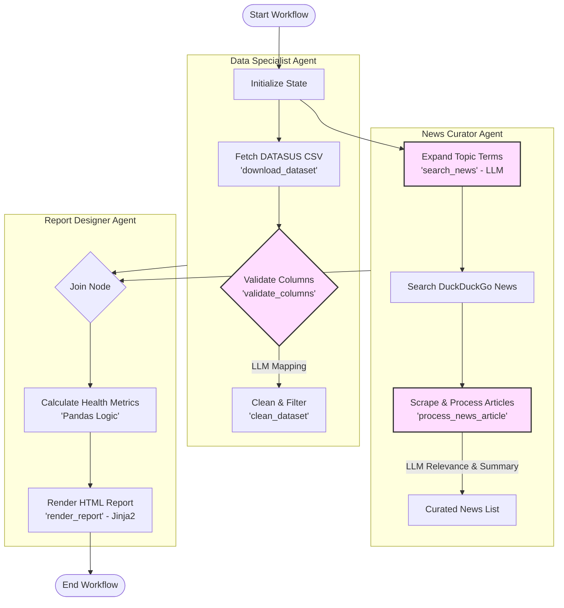

# Indicium Health Data Agent - Project Documentation

## Project Overview

This project implements an autonomous AI system designed to monitor public health data from **DATASUS (OpenDataSUS)** and correlate it with recent news articles. The system uses a multi-agent architecture powered by **LangGraph** to automate the process of data collection, validation, curation, and report generation.

---

## High-Level Architecture

The system is organized into three main pipelines that execute in parallel and join for the final report creation.

### 1. Data Pipeline (Data Specialist Agent)

Responsible for handling epidemiological data from the SRAG (Severe Acute Respiratory Syndrome) database.

- **Fetch**: Automatically identifies the most recent CSV file from the OpenDataSUS portal based on year and metadata.
- **LLM Mapping**: Uses an LLM to map inconsistent or changing CSV column names to a standardized schema using the official data dictionary PDF as context.
- **Transformation**: Filters data by date range (last 12 months) and cleans fields for analysis.

### 2. News Pipeline (News Curator Agent)

Responsible for fetching and summarizing relevant public health news.

- **LLM Topic Expansion**: Uses an LLM to generate synonyms and related search terms to ensure comprehensive coverage.
- **Search**: Scrapes DuckDuckGo News for the expanded topics.
- **LLM Curation**: For each article found, an LLM checks for relevance to the specific health topic and generates a concise summary in Portuguese.

### 3. Report Generation (Report Designer Agent)

Synthesizes data and news into a visual report.

- **Metrics**: Calculates key performance indicators (KPIs) such as mortality rates, hospitalization rates, ICU occupancy, and case growth percentages using Pandas.
- **Rendering**: Generates a professional HTML report using Jinja2 templates, incorporating interactive charts (via Chart.js) and curated news cards.

---

## Agent Tools & Functionalities

Each agent is equipped with specific tools to perform its tasks effectively.

### 1. Data Specialist Agent Tools

| Tool                  | Functionality                                                                                                                                   |
| :-------------------- | :---------------------------------------------------------------------------------------------------------------------------------------------- |
| `download_dataset`    | Scrapes the OpenDataSUS portal to identify the most recent SRAG dataset, follows download links, and saves the CSV locally with a progress bar. |
| `validate_columns`    | **(LLM-Powered)** Reads the data dictionary PDF and the raw CSV header to intelligently map field names to the system schema.                   |
| `clean_dataset`       | Loads raw data into Pandas, applies column mappings, filters by date (last 12 months), and saves a "refined" version for analysis.              |
| `find_latest_dataset` | Scans the local `data/` directory to reuse existing files and avoid redundant downloads.                                                        |

### 2. News Curator Agent Tools

| Tool                   | Functionality                                                                                                                  |
| :--------------------- | :----------------------------------------------------------------------------------------------------------------------------- |
| `search_news`          | **(LLM-Powered)** First expands the main topic into semantic synonyms, then performs targeted searches on DuckDuckGo News.     |
| `process_news_article` | **(LLM-Powered)** Scrapes full article text from URLs and uses an LLM to evaluate relevance and generate a Portuguese summary. |

### 3. Report Designer Agent Tools

| Tool                  | Functionality                                                                                                      |
| :-------------------- | :----------------------------------------------------------------------------------------------------------------- |
| `render_report`       | Uses Jinja2 templates to combine calculated metrics and news articles into a professional, responsive HTML report. |
| `cleanup_old_reports` | Maintains the `output/` directory by keeping only the 3 most recent reports.                                       |
| **Calculation Logic** | Executes complex Pandas aggregations for mortality, hospitalization, and growth rate calculations.                 |

---

## Conceptual Diagram

---

## Explicit LLM Usage

The system leverages LLMs (specifically `gemini-2.5-flash`) at critical decision points where structured logic is insufficient:

| Step                | Tool/Function          | Purpose of LLM                                                                                                                                |
| :------------------ | :--------------------- | :-------------------------------------------------------------------------------------------------------------------------------------------- |
| **Column Mapping**  | `validate_columns`     | Analyzes raw CSV headers and compares them to the Data Dictionary PDF text to find correct field mappings despite naming variations.          |
| **Topic Expansion** | `search_news`          | Generates 5+ semantic variations of the search topic (e.g., "Dengue" -> "Aedes aegypti", "epidemia de arboviroses") to improve search recall. |
| **News Curation**   | `process_news_article` | Acts as a filter to reject "noise" (off-topic articles) and generates the summaries used in the final report.                                 |

---

## Metric Calculation Logic

1.  **Confirmed Cases**: Count of records where the classification field (`CLASSI_FIN`) is not null in the current month.
2.  **Mortality Rate**: Percentage of deaths among confirmed cases (`EVOLUCAO = 2` and `CLASSI_FIN` present).
3.  **Hospitalization Rate**: Percentage of total notifications that required hospital admission (`HOSPITAL = 1`).
4.  **Growth Rates**: Month-over-month percentage change in total notifications and confirmed cases.
5.  **State Rankings**: Aggregation of notifications by Federation Unit (`SG_UF_NOT`).
