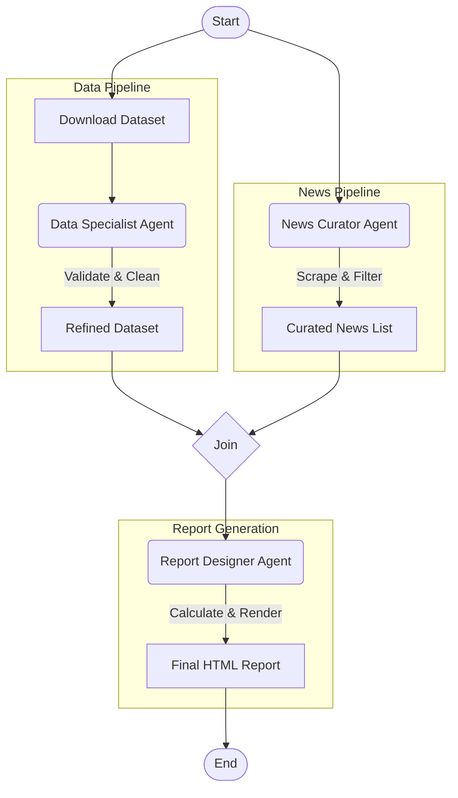

# Indicium FAI Challenge - Health Data AI Agent

An intelligent AI agent system for automated public health data analysis and reporting, built with LangGraph and LangChain.

## 🎯 Overview

This project implements an agentic solution that:

1. **Downloads SRAG Data**: Fetches the latest Severe Acute Respiratory Syndrome (SRAG) dataset from Brazil's DATASUS OpenDataSUS portal
2. **Validates & Cleans Data**: Uses LLM-powered column mapping to select relevant fields and applies date filters
3. **Curates Health News**: Searches, scrapes, and summarizes relevant health news articles
4. **Generates Reports**: Creates beautiful HTML reports with metrics and curated news

## 🏗️ Architecture



## 🚀 Quick Start

### Prerequisites

- Python 3.12+
- [uv](https://github.com/astral-sh/uv) (recommended) or pip
- API key for your chosen LLM provider (currently available OpenAI and Google Vertex AI)

### Installation

1. **Clone the repository**
   ```bash
   git clone git@github.com:hbeltrao/indicium_fai_challenge.git
   cd indicium_fai_challenge
   ```

2. **Install dependencies**
   ```bash
   # Using uv (recommended)
   uv sync
   
   # Or using pip
   pip install -e .
   ```

3. **Configure environment**
   ```bash
   cp .env.example .env
   # Edit .env with your API keys and preferences
   ```

4. **Run the agent**
   ```bash
   uv run main.py
   # Or: python main.py
   ```

## ⚙️ Configuration

The application supports multiple LLM providers. Configure via `.env` file:

### Option 1: Google AI Studio (Easiest)
```env
LLM_PROVIDER=google_genai
LLM_MODEL_NAME=gemini-2.0-flash
GOOGLE_API_KEY=your-api-key-from-aistudio
```

### Option 2: Google Vertex AI
```env
LLM_PROVIDER=vertexai
LLM_MODEL_NAME=gemini-2.0-flash
GOOGLE_CLOUD_PROJECT=your-gcp-project
GOOGLE_CLOUD_LOCATION=us-central1
```

### Option 3: OpenAI
```env
LLM_PROVIDER=openai
LLM_MODEL_NAME=gpt-4o-mini
OPENAI_API_KEY=sk-your-openai-key
```

### LangSmith Tracing (Optional)
```env
LANGCHAIN_TRACING_V2=true
LANGCHAIN_API_KEY=lsv2_your-key
LANGCHAIN_PROJECT=indicium-fai-challenge
```

## 📁 Project Structure

```
indicium_fai_challenge/
├── app/
│   ├── agents/           # LangGraph agents
│   │   ├── data_specialist.py   # Data download, validation, cleaning
│   │   ├── news_curator.py      # News search, scrape, curate
│   │   ├── report_designer.py   # Metrics calculation, report generation
│   │   └── states.py            # Workflow state definitions
│   ├── config/
│   │   └── settings.py   # Pydantic settings configuration
│   ├── models/
│   │   └── llms.py       # LLM factory and providers
│   ├── templates/
│   │   └── report_template.html  # Jinja2 report template
│   ├── tools/            # LangChain tools
│   │   ├── data_tools.py    # Dataset download, validate, clean
│   │   ├── news_tools.py    # News search and processing
│   │   └── report_tools.py  # HTML report generation
│   ├── utils/
│   │   └── logging.py    # Logging configuration
│   └── workflows/
│       └── main_workflow.py  # LangGraph workflow definition
├── data/                 # Data files (datasets, dictionaries)
├── output/               # Generated reports
├── logs/                 # Log files
├── main.py               # Entry point
├── pyproject.toml        # Project dependencies
├── .env.example          # Environment configuration template
└── README.md             # This file
```

## 🔧 Development

### Running Tests
```bash
# Run individual test files
python test_workflow_execution.py
python test_validate_tool.py
python test_clean_tool.py
python test_news_tools.py
```

### Adding New Metrics

Edit `app/agents/report_designer.py` and add calculations in `_calculate_metrics()`:

```python
def _calculate_metrics(dataset_path: str) -> Dict[str, Any]:
    # ... existing code ...
    
    # Add your new metric
    if "YOUR_COLUMN" in df.columns:
        metrics["your_metric"] = calculate_your_metric(df)
```

### Customizing the Report Template

Edit `app/templates/report_template.html`. The template receives:
- `generation_date`: Report generation timestamp
- `refined_dataset_path`: Path to the dataset used
- `metrics`: Dictionary with calculated metrics
- `news_articles`: List of `NewsArticle` objects
- `topic`: Search topic
- `errors`: List of error messages

## 📊 Output

Reports are saved to the `output/` directory as HTML files:
- Filename format: `report_YYYYMMDD_HHMMSS.html`
- Old reports are automatically cleaned up (keeps last 10)

## 🔒 Security Notes

- Never commit `.env` files with real API keys
- Use environment variables or secret managers in production
- The application validates credentials on startup

## 🤝 Contributing

1. Fork the repository
2. Create a feature branch: `git checkout -b feature/my-feature`
3. Commit changes: `git commit -am 'Add my feature'`
4. Push: `git push origin feature/my-feature`
5. Open a Pull Request

## 📄 License

This project is licensed under the MIT License.

## 🙏 Acknowledgments

- [DATASUS](https://opendatasus.saude.gov.br/) for the SRAG dataset
- [LangChain](https://langchain.com/) & [LangGraph](https://langchain-ai.github.io/langgraph/) for the agent framework
- [Google AI](https://ai.google.dev/) for Gemini models
